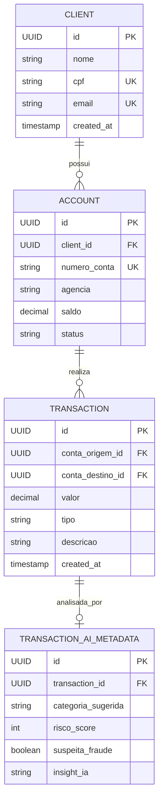

# 🏦 AuraBank — Core Bancário Inteligente com IA & Open Finance
### Especificação Técnica de Arquitetura e Negócio (RFC / Blueprint)

---

## 🎯 1. Visão Geral do Produto

O **AuraBank** é uma plataforma de core bancário fullstack moderna projetada para simular o ecossistema real de grandes instituições financeiras (Itaú, Bradesco, Santander). 

O sistema resolve dois desafios fundamentais do setor financeiro:
1. **Segurança Transacional & Concorrência:** Garantia de atomicidade (ACID), integridade de saldo e concorrência em transferências financeiras (PIX/TED simulados).
2. **Inteligência em Finanças (Open Finance & IA):** Motor analítico assíncrono para categorização automática de transações, detecção de anomalias/fraudes e geração de insights financeiros para o correntista.

---

## 🏗️ 2. Arquitetura do Sistema

```mermaid
flowchart TB
    subgraph Frontend["💻 Frontend (React 18 + TypeScript)"]
        UI_DASH["Dashboard Financeiro<br/>Extrato, Saldo, Gráficos & Transferências"]
        UI_AI["Assistente Virtual de Finanças<br/>Chat de Insights com IA"]
    end

    subgraph CoreBancario["☕ Core Transacional (Java 17 + Spring Boot)"]
        AUTH["Spring Security + JWT<br/>Autenticação de Correntistas"]
        ACCOUNTS["Account & Client Service<br/>Gestão de Contas Correntes"]
        TRANSACTIONS["Transaction Engine (@Transactional)<br/>Validação de Saldo, Idempotência & Ledger"]
        SWAGGER["SpringDoc OpenAPI / Swagger<br/>Documentação Viva da API"]
        JUNIT["Suite de Testes Unitários<br/>JUnit 5 + Mockito"]
    end

    subgraph Inteligencia["🐍 AI Analytics Service (Python 3.11 + FastAPI)"]
        FRAUD_ENGINE["Detecção de Anomalias / Score de Risco<br/>Análise de Padrão de Consumo"]
        CATEGORIZER["Categorizador Automático com IA<br/>Classificação Semântica de Gastos"]
        INSIGHTS["Advisor de Finanças Pessoais<br/>Resumos Financeiros com LLM"]
    end

    subgraph Dados["💾 Persistência"]
        POSTGRES[(PostgreSQL 16 Relacional)]
    end

    UI_DASH <-->|HTTPS / REST API| CoreBancario
    UI_AI <-->|HTTPS / REST API| Inteligencia
    CoreBancario -->|Eventos de Transação (REST)| Inteligencia
    CoreBancario <-->|Spring Data JPA / Hibernate| POSTGRES
    Inteligencia <-->|SQLAlchemy (Leitura Analítica)| POSTGRES
```

---

## 🧩 3. Módulos e Responsabilidades

### Módulo 1: Core Bancário (Java 17 + Spring Boot)
* **Padrão Arquitetural:** Clean Architecture em camadas (`Controller` -> `Service` -> `Repository` -> `DTO`).
* **Regras de Negócio Críticas:**
  * **Transações Atômicas:** Uso de `@Transactional(isolation = Isolation.REPEATABLE_READ)` para evitar leitura suja e saques simultâneos acima do saldo.
  * **Idempotência:** Chave única de transação (`transaction_id` UUID) para evitar pagamentos duplicados por instabilidade de rede.
  * **Tratamento Global de Exceções:** `@RestControllerAdvice` capturando exceções de domínio:
    * `SaldoInsuficienteException` (HTTP 422)
    * `ContaNaoEncontradaException` (HTTP 404)
    * `TransacaoDuplicadaException` (HTTP 409)
* **Testes Automatizados:** Cobertura de regras financeiras com **JUnit 5** e **Mockito**.

### Módulo 2: Motor de Inteligência Financeira (Python + FastAPI)
* **Framework:** FastAPI com Pydantic para tipagem estrita de dados.
* **Funcionalidades com IA:**
  * **Classificador Semântico:** Identifica automaticamente se uma cobrança `"Uber *Trip"` é *Transporte* ou se `"Carrefour Express"` é *Alimentação*.
  * **Anti-Fraud Guard:** Calcula um **Score de Risco (0 a 100)** para cada transação baseado no histórico do cliente (horário, valor médio e localização).
  * **Insights com LLM:** Geração de relatórios mensais compreensíveis via IA.

### Módulo 3: Interface Web do Correntista (React + TypeScript)
* **Stack:** React 18, TypeScript, Tailwind CSS, Lucide Icons, Shadcn UI.
* **Componentes:**
  * Card de Saldo com ocultação de valores.
  * Formulário de Transferência rápida com feedback visual instantâneo.
  * Extrato interativo com tags automáticas de categorias da IA.
  * Drawer / Chat lateral de assessoria financeira com IA.

---

## 🗄️ 4. Modelo de Dados Principal (PostgreSQL)



---

## 🎯 5. Mapeamento com a Grade de Contratação da GFT

| Exigência Recorrente da GFT | Onde é Provado no AuraBank |
| :--- | :--- |
| **Java 17 & POO Sólida** | Entidades de domínio ricas, Records e validação estrita. |
| **Spring Boot & JPA** | Repositórios otimizados e relacionamentos mapeados com Hibernate. |
| **Arquitetura de Microsserviços & REST** | Comunicação entre serviço transacional Java e serviço analítico Python. |
| **Tratamento de Concorrência & ACID** | Lógica de transferência com travas de saldo e idempotência bancária. |
| **Testes Unitários (JUnit 5 + Mockito)** | Testes de unidade cobrindo todos os cenários de sucesso e falha. |
| **Python & Manipulação de Dados** | Módulo analítico com FastAPI e tratamento de dados com Pandas. |
| **Inovação com IA / GenAI** | Classificação de dados e geração de insights com IA integrada. |
| **Frontend Moderno (React + TypeScript)** | Interface responsiva, reativa e profissional para o correntista. |
| **Deploy & Docker** | `docker-compose.yml` que orquestra todos os serviços localmente com um comando. |

---

## 📅 6. Roadmap de Implementação em Fases

* **Fase 1:** Setup do repositório, Docker Compose com PostgreSQL e modelagem do banco.
* **Fase 2:** Backend Java (Spring Boot) com criação de contas, transações atômicas e testes unitários JUnit.
* **Fase 3:** Backend Python (FastAPI) com motor de IA para categorização e score anti-fraude.
* **Fase 4:** Frontend React + TypeScript com dashboard bancário e extrato inteligente.
* **Fase 5:** Documentação com Swagger, gravação de demo em vídeo e publicação do case no LinkedIn & GitHub.
