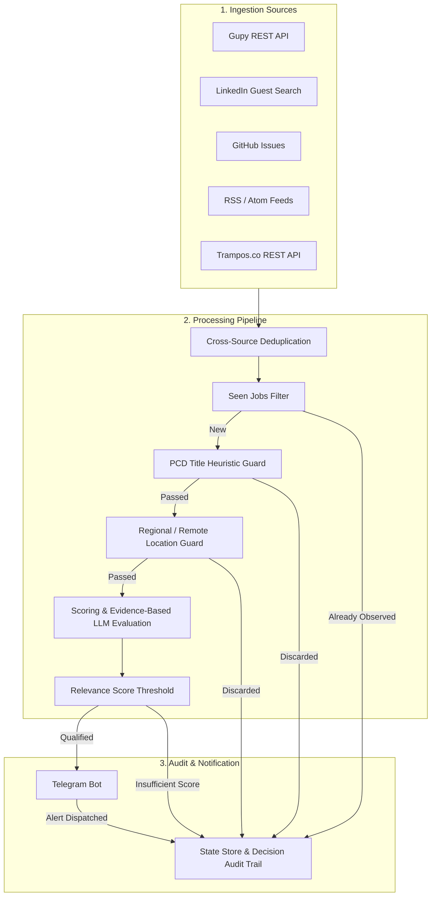

# Job Finder

Automated software engineering job monitor with multi-source collection, deterministic filtering, and semantic evaluation, running on scheduled GitHub Actions workflows.

---

## 🎯 What It Does

Job Finder monitors technical job postings across multiple platforms for software engineering opportunities (configured for **Node.js, React, TypeScript, Java, and Python** at **Internship, Trainee, and Junior** levels).

Candidate positions are processed through deterministic filtering (geographic radius, affirmative-action signals, seniority detection), profiled for context evidence density, and conditionally evaluated by a constrained LLM-based semantic judge for selected ambiguous candidates. Alerts are dispatched to **Telegram**.

---

## 🏗️ How It Works

The batch pipeline processes collected positions in sequential stages:



---

## 📡 Ingestion Sources

| Source | Target / Scope | Mechanism |
| :--- | :--- | :--- |
| **Gupy** | Targeted company monitors and entry-level keyword searches | Public REST API |
| **LinkedIn** | Role and company keyword queries | Unauthenticated Guest Search |
| **GitHub Issues** | Configured developer communities | GitHub REST API |
| **RSS** | Configured search indices and corporate career feeds | XML / Atom with RFC-822 / ISO-8601 parsing |
| **Trampos.co** | Junior and technical opportunities | Public REST API |

---

## ⚖️ Scope & Trade-offs

Job Finder is designed as a **single-user / single-profile scheduled batch process**:

- **No external database infrastructure**: Uses a Git-versioned state file (`seen_jobs.json`) to persist observed jobs across ephemeral GitHub Actions runners without hosting costs ([ADR-001](docs/adr/ADR-001-git-state-persistence.md)).
- **Selective LLM utilization**: Deterministic heuristics and evidence density profiling filter out non-matching or low-context items before semantic evaluation, reducing unnecessary API calls and preserving available quotas ([ADR-002](docs/adr/ADR-002-llm-after-deterministic-filtering.md)).
- **Independent identity & content tracking**: Separates identity hashing from description hashing to accurately detect identical roles cross-platform ([ADR-003](docs/adr/ADR-003-identity-content-decoupling.md)).
- **Deliberate boundaries**: The system does not attempt to be a high-concurrency universal job aggregator or real-time indexer; it prioritizes operational simplicity, cost efficiency, and auditable decision-making.

---

## 📚 Engineering Documentation

The project's architectural decisions, development process, and evolution history are documented in [`docs/`](docs/):

- **[Evolution History](docs/engineering/evolution-history.md)**: Progression from the initial single-file script to the current layered pipeline, reconstructed from repository commits.
- **[Engineering Methodology](docs/engineering/methodology.md)**: Development process, test-backed verification, and the distinction between *AI-Assisted Development* (build time) and *AI at Runtime* (semantic evaluation stage).
- **Architecture Decision Records (ADRs)**:
  - [ADR-001: Git-Based State Persistence](docs/adr/ADR-001-git-state-persistence.md)
  - [ADR-002: Deterministic Filtering Before LLM Evaluation](docs/adr/ADR-002-llm-after-deterministic-filtering.md)
  - [ADR-003: Identity and Content Decoupling](docs/adr/ADR-003-identity-content-decoupling.md)
  - [ADR-004: Multi-Stage Job Evaluation Pipeline](docs/adr/ADR-004-multi-stage-job-evaluation-pipeline.md)

---

## 🚀 Quick Start

### 1. Requirements
- Python 3.10+
- Git

### 2. Setup
```bash
git clone https://github.com/RafalauriSantos/job-finder.git
cd job-finder
pip install -r requirements.txt
```

### 3. Environment Configuration (`.env`)
```env
TELEGRAM_BOT_TOKEN=your_token_here
TELEGRAM_CHAT_ID=your_chat_id_here

# Optional: enables LLM semantic evaluation (Google Gemini)
GEMINI_API_KEY=your_gemini_key_here

# Optional: secondary LLM fallback (Anthropic Claude)
ANTHROPIC_API_KEY=your_anthropic_key_here

# Optional: increases GitHub API rate limit from 60 to 5000 req/hr
GITHUB_TOKEN=your_github_token_here
```


### 4. Running
- **Execute single cycle:**
  ```bash
  python monitor.py --once
  ```
- **Run continuous daemon (local):**
  ```bash
  python monitor.py
  ```

---

## 🧪 Automated Tests

The test suite covers normalization, deduplication, URL resolution, evidence density, scoring rules, and failure handling:

```bash
pytest tests/ -v
```

---

## ⚙️ Scheduled Automation

The repository includes a GitHub Actions workflow ([`.github/workflows/monitor.yml`](.github/workflows/monitor.yml)) configured to run periodically, committing state updates back to `seen_jobs.json` to maintain persistence across runs.

---

## 📄 License

Distributed under the [MIT](LICENSE) License.
