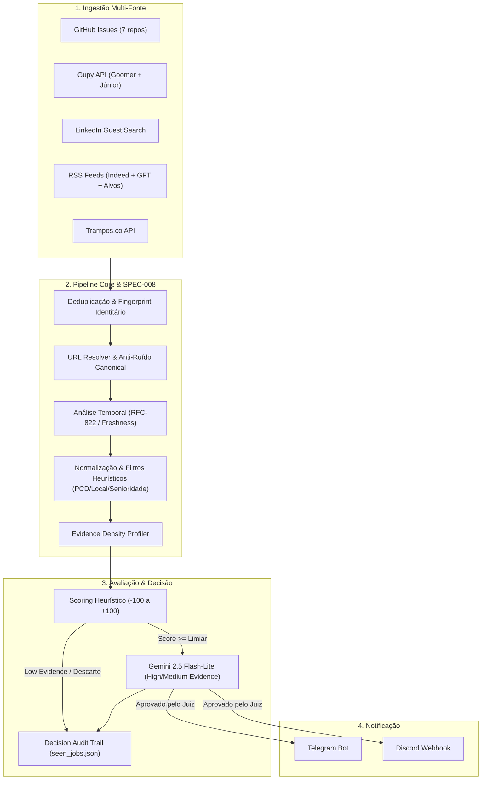

# Job Finder v2.2 — Autonomous Career Intelligence Engine 🎯🚀

[](tests/)
[](https://www.python.org/)
[](LICENSE)
[](#-custo-zero--alta-efici%C3%AAncia)
[](#-camada-de-ia-sem%C3%A2ntica-gemini-25-flash-lite)

O **Job Finder** é um mecanismo autônomo de inteligência de carreira e monitoramento de vagas em tempo real para desenvolvedores de software (foco em **Node.js, React, TypeScript, Java, Python** nos níveis **Estágio, Trainee e Júnior**).

Projetado com arquitetura limpa em camadas, resiliência operacional, triagem heurística e julgamento semântico com IA Generativa, operando **24/7 com custo $0.00/mês**.

---

## 📑 Sumário

- [Visão Geral e Arquitetura](#-vis%C3%A3o-geral-e-arquitetura)
- [Fontes de Dados e Coletores Nativos](#-fontes-de-dados-e-coletores-nativos)
- [Núcleo de Inteligência e Anti-Ruído (SPEC-008)](#-n%C3%BAcleo-de-intelig%C3%AAncia-e-anti-ru%C3%ADdo-spec-008)
- [Camada de IA Semântica (Gemini 2.5 Flash-Lite)](#-camada-de-ia-sem%C3%A2ntica-gemini-25-flash-lite)
- [Trilha de Auditoria e Decisão](#-trilha-de-auditoria-e-decis%C3%A3o)
- [Custo Zero & Alta Eficiência](#-custo-zero--alta-efici%C3%AAncia)
- [Estrutura do Projeto](#-estrutura-do-projeto)
- [Instalação e Execução Local](#-instala%C3%A7%C3%A3o-e-execu%C3%A7%C3%A3o-local)
- [Automação 24/7 no GitHub Actions](#-automa%C3%A7%C3%A3o-247-no-github-actions)
- [Testes Automatizados](#-testes-automatizados)

---

## 🏛️ Visão Geral e Arquitetura

O sistema opera como um pipeline unidirecional com múltiplos estágios:



---

## 📡 Fontes de Dados e Coletores Nativos

O Job Finder não depende de uma única plataforma. Ele varre a web técnica onde os melhores times e desenvolvedores publicam vagas:

| Coletor | Cobertura / Alvos | Mecanismo |
| :--- | :--- | :--- |
| **GitHub Issues** | `frontendbr/vagas`, `backend-br/vagas`, `react-brasil/vagas`, `soujava/vagas-java`, `nodejsdevbr/vagas`, `frontend-pt/vagas`, `backend-pt/vagas` | GitHub REST API (v3) sem autenticação ou com `GITHUB_TOKEN` |
| **Gupy API** | Monitor oficial da Goomer (`companyId: 2245`), buscas gerais de Júnior | Endpoints oficiais `/api/v1/jobs` com paginação automática |
| **LinkedIn Jobs** | 7 perfis de busca (React, Node, Java, Python, Full Stack, GFT, Goomer) | Guest Search sem credenciais (anti-ban/resiliente a 429) |
| **RSS & News Index** | Indeed Remote/Regional, portal oficial da GFT (`jobs.gft.com` no SAP SuccessFactors), Goomer, Flavia Nasser | Feeds XML/Atom com parsing RFC-822/ISO-8601 |
| **Trampos.co** | Vagas de tecnologia e estágio/júnior | REST API nativa pública com descompressão gzip/brotli |

---

## 🛡️ Núcleo de Inteligência e Anti-Ruído (SPEC-008)

Para evitar alertas desnecessários e duplicidades entre canais diferentes, o Job Finder implementa uma suíte de salvaguardas avançadas:

1. **Fingerprint Identitário vs Content Hash Desacoplados**:
   - `identity_fingerprint`: Gerado por `sha256(canonical_company:canonical_title:workplace_type)`. Garante que a mesma vaga postada no LinkedIn, Gupy e GitHub seja identificada como idêntica.
   - `content_hash`: Detecta alterações reais na descrição da vaga para evitar renotificar o usuário se o texto apenas sofreu pequenas edições.
2. **Tripartite URL Resolution & Anti-Ruído**:
   - `raw_url` ➔ `resolved_url` ➔ `canonical_url`.
   - Limpeza completa de parâmetros UTM, tracking tokens e identificadores transitórios de sessão.
   - Rejeição automática de URLs de landing pages, buscas vazias, homepages e artigos institucionais.
3. **Análise de Frequência e Frescor Temporal (Temporal Guard)**:
   - Parser RFC-822 / ISO-8601 que categoriza cada item como `FRESH`, `STALE` ou `UNKNOWN`. Vagas com mais de 30 dias são descartadas antes de consumir quota.
4. **Filtro Heurístico PCD Exclusivo**:
   - Heurística focada no título (ex: `[PCD]`, `Exclusivo PCD`), respeitando vagas inclusivas para ampla concorrência sem gerar falsos positivos de disclaimers corporativos.
5. **Normalização Geográfica Regional & Remota**:
   - Aceita automaticamente vagas 100% remotas ou presenciais/híbridas no raio regional do desenvolvedor (**Sorocaba, Tatuí, Itapetininga, Boituva, Salto, Itu, Votorantim**).

---

## 🧠 Camada de IA Semântica (Gemini 2.5 Flash-Lite)

Quando uma vaga passa pelos filtros iniciais e atinge o limiar de aderência, ela é submetida ao **Juiz Semântico com IA**:

- **Modelo**: `gemini-2.5-flash-lite` (Google AI).
- **Evidence Density Profiler**: Analisa a riqueza de contexto do anúncio (`HIGH_EVIDENCE`, `MEDIUM_EVIDENCE`, `LOW_EVIDENCE`). Apenas itens com densidade suficiente invocam a LLM, respeitando o teto de 15 requisições por minuto do tier gratuito.
- **Avaliação Multidimensional**:
  - Aderência real ao currículo do candidato (JavaScript, TypeScript, React, Node, Python, Java).
  - Alinhamento de senioridade (rejeição de requisitos mascarados de sênior disfarçados de júnior).
  - Modalidade de trabalho e localização.
- **Saída Estruturada**: Decisão booleana com justificativa resumida e taxa de fit (`0-100%`).

---

## 📋 Trilha de Auditoria e Decisão

Todas as decisões do motor (aprovado, reprovado por senioridade, rejeitado por localidade, descartado por score baixo, aprovado por IA) são gravadas com auditoria em tempo real no `seen_jobs.json`:

```json
{
  "recent_decisions": [
    {
      "timestamp": "2026-09-13T19:40:00Z",
      "title": "Desenvolvedor(a) Front-end Jr (React)",
      "company": "Goomer",
      "score": 85,
      "ai_evaluated": true,
      "verdict": "APPROVED",
      "reason": "Vaga júnior com foco em React e TypeScript, 100% remota."
    }
  ]
}
```

Isso permite inspeção instantânea por modelos de raciocínio (Claude, GPT, Gemini) e depuração contínua do comportamento dos coletores.

---

## 💰 Custo Zero & Alta Eficiência

O projeto foi intencionalmente arquitetado para rodar indefinidamente com **$0.00 de custo operacional**:

- **GitHub Actions**: Repositório público com consumo ilimitado de minutos gratuitos em runners padrão Ubuntu.
- **Google Gemini API**: Opera na cota gratuita do Google AI Studio (`gemini-2.5-flash-lite` com Evidence Profiling e rate-limiting adaptativo).
- **Notificações Telegram / Discord**: APIs oficiais gratuitas.
- **Sem Servidor Dedicado**: Estado persistido automaticamente no próprio repositório via commit do `seen_jobs.json`.

---

## 📂 Estrutura do Projeto

```
job-finder/
├── .github/
│   └── workflows/
│       └── monitor.yml           # Cron 24/7 do GitHub Actions
├── collectors/                   # Módulos de ingestão de dados
│   ├── base.py                   # Contrato BaseCollector
│   ├── github_collector.py       # Coletor de 7 repositórios GitHub
│   ├── gupy_collector.py         # Coletor oficial Gupy REST API
│   ├── linkedin_collector.py     # Guest search multi-query do LinkedIn
│   ├── rss_collector.py          # Parser RFC-822/Atom (Indeed, GFT, etc.)
│   └── trampos_collector.py      # REST API do Trampos.co
├── core/                         # Motor de processamento e inteligência
│   ├── cv_profile.py             # Perfil profissional e stacks do candidato
│   ├── evidence.py               # Evidence Density Profiler (SPEC-008)
│   ├── normalizer.py             # Normalização de títulos, locais e PCD
│   ├── scoring.py                # Motor heurístico de pontuação
│   └── url_resolver.py           # Canonicalizador tripartite e anti-noise
├── judge/                        # Julgamento semântico com IA
│   ├── gemini_judge.py           # Cliente Gemini 2.5 Flash-Lite com rate limit
│   └── mock_judge.py             # Juiz determinístico para suíte de testes
├── models/
│   └── job.py                    # Entidade Job e dataclasses
├── storage/
│   └── state_store.py            # Persistência de IDs e Decision Audit Trail
├── tests/                        # 84 testes automatizados (pytest)
│   ├── test_collectors.py
│   ├── test_normalizer.py
│   ├── test_scoring.py
│   ├── test_spec008_*.py
│   └── test_state_store.py
├── config.json                   # Configuração de coletores e parâmetros
├── monitor.py                    # Orquestrador principal da CLI
├── requirements.txt              # Dependências de produção e testes
└── seen_jobs.json                # Banco de estado e auditoria de decisões
```

---

## 🚀 Instalação e Execução Local

### 1. Pré-requisitos
- Python 3.10 ou superior
- Git

### 2. Clonar e Instalar Dependências
```bash
git clone https://github.com/RafalauriSantos/job-finder.git
cd job-finder
pip install -r requirements.txt
```

### 3. Configurar Variáveis de Ambiente (`.env`)
Crie um arquivo `.env` na raiz (o `.gitignore` garante que ele nunca será versionado):
```env
# Notificações (Telegram ou Discord)
TELEGRAM_BOT_TOKEN=seu_bot_token_aqui
TELEGRAM_CHAT_ID=seu_chat_id_aqui
# DISCORD_WEBHOOK_URL=https://discord.com/api/webhooks/...

# IA Semântica (Google Gemini)
GEMINI_API_KEY=sua_chave_gemini_aqui

# Opcional (aumenta o rate-limit do GitHub Collector de 60 para 5.000 req/hora)
GITHUB_TOKEN=seu_github_token_pessoal
```

### 4. Execução
- **Executar uma única varredura de teste:**
  ```bash
  python monitor.py --once
  ```

- **Rodar em modo contínuo (daemon local):**
  ```bash
  python monitor.py
  ```

---

## 🤖 Automação 24/7 no GitHub Actions

O repositório já inclui o workflow [`.github/workflows/monitor.yml`](.github/workflows/monitor.yml) configurado para rodar a cada 15 minutos de forma autônoma.

Para ativar no seu fork/repositório:
1. Acesse **Settings > Secrets and variables > Actions**.
2. Adicione as seguintes *Repository Secrets*:
   - `TELEGRAM_BOT_TOKEN`
   - `TELEGRAM_CHAT_ID`
   - `GEMINI_API_KEY` (Opcional, habilita julgamento com IA)
   - `PERSONAL_ACCESS_TOKEN` (Opcional, para GitHub API estendida)
3. Vá na aba **Actions** e habilite o workflow. Ele executará periodicamente e comitará o `seen_jobs.json` atualizado para manter o estado persistido entre runs.

---

## 🧪 Testes Automatizados

O Job Finder adota rigor de engenharia com **84 testes unitários e de integração**, cobrindo normalização, anti-ruído, scoring, IA, tolerância a falhas e os requisitos da **SPEC-008**.

Para rodar a suíte completa:
```bash
pytest tests/ -v
```

Resultado esperado:
```text
============================== 84 passed in 2.10s ==============================
```

---

## 📄 Licença

Distribuído sob a licença [MIT](LICENSE). Desenvolvido para transformar a busca de oportunidades técnicas em um processo inteligente, automatizado e de alta precisão.

