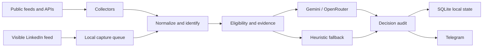

# Job Finder

Local-first radar for software engineering opportunities. The project collects
public listings from multiple sources, normalizes and deduplicates them,
applies deterministic eligibility rules, evaluates ambiguous cases with a
configurable LLM provider and sends useful decisions to Telegram.

It is a personal project designed to run continuously on a Linux host. GitHub
is used for source control and automated tests; production collection and
runtime state remain on the local machine.

## Why this project exists

Job search data is fragmented, duplicated and often incomplete. Job Finder
turns that problem into an auditable pipeline with explicit decisions:


```mermaid
flowchart LR
    A[Public feeds and APIs] --> B[Collectors]
    C[Visible LinkedIn feed] --> D[Local capture queue]
    B --> E[Normalize and identify]
    D --> E
    E --> F[Eligibility and evidence]
    F --> G[Gemini / OpenRouter]
    F --> H[Heuristic fallback]
    G --> I[Decision audit]
    H --> I
    I --> J[SQLite local state]
    I --> K[Telegram]
```

The detailed design is in [Architecture](docs/architecture.md). Engineering
decisions and evolution history are documented in [docs/](docs/).

## Capabilities

- Multi-source collection through public APIs, RSS/Atom feeds and public ATS
  listings.
- LinkedIn browser capture for content already visible in an authenticated
  desktop browser session.
- Stable source identity using native IDs and normalized URLs.
- Cross-source deduplication and evidence-aware filtering.
- Configurable Gemini or OpenRouter provider with a shared judge interface.
- Deterministic heuristic fallback when an LLM is unavailable.
- Manual URL intake and an independent worker for immediate analysis.
- SQLite audit trail for decisions, collection attempts and recovery.
- Telegram notifications, local health checks and an external heartbeat.
- Automated tests and CI that validate code without executing real collection.

## Sources

| Source | Access pattern | Role |
| --- | --- | --- |
| Gupy | Public API and detail enrichment | Targeted company listings |
| GitHub Issues | GitHub REST API | Community job boards |
| RSS/Atom | Public feeds | Career pages and search feeds |
| Trampos.co | Public listing API | Technical opportunities |
| GeekHunter | Public listing/detail pages | Complementary source |
| LinkedIn | Guest queries plus visible browser capture | Coverage complement |

LinkedIn coverage is intentionally bounded. The browser extension only submits
posts that LinkedIn has loaded in the open feed. It does not bypass login,
challenges, rate limits or access controls.

## Reliability and safety

Each source has isolated timeout, retry and rate-limit handling. A source
failure is recorded and does not have to stop the complete cycle. A separate
manual worker prevents a user-submitted URL from waiting for the scheduled
radar. systemd restarts local services, while the heartbeat gives an external
signal when the host stops checking in.

Secrets, browser profiles, databases and runtime logs stay outside Git. See
[SECURITY.md](SECURITY.md) for the security boundary and
[CONTRIBUTING.md](CONTRIBUTING.md) for repository hygiene.

## Quick start

Requirements: Python 3.10 or newer and Git.

```bash
git clone https://github.com/RafalauriSantos/job-finder.git
cd job-finder
python -m venv .venv
source .venv/bin/activate
python -m pip install -r requirements.txt
cp .env.example .env
```

Edit `.env` with local values. Keep the real file untracked. The public
configuration template is [config.example.json](config.example.json); the
personal `config.json` contains the owner's monitor selection.

For Gemini:

```env
LLM_PROVIDER=gemini
LLM_MODEL=
GEMINI_API_KEY=your_key_here
```

For OpenRouter:

```env
LLM_PROVIDER=openrouter
LLM_MODEL=google/gemini-2.5-flash-lite
OPENROUTER_API_KEY=your_key_here
```

Run one cycle or start the local runner:

```bash
python monitor.py --once
python monitor.py
```

The systemd units under `deployment/` are installation examples for the local
host. They should be reviewed for the installation path before being copied to
the system unit directory.

## Manual and LinkedIn intake

Register a URL with the lightweight CLI:

```bash
./workhunter add 'https://www.linkedin.com/jobs/view/123456789/'
./workhunter worker-once
./workhunter diagnose
```

The browser extension under `tools/linkedin_extension/` captures relevant
posts visible in the LinkedIn feed and sends them to the loopback receiver.
The receiver deduplicates content and places it in the same analysis pipeline.

## Testing

The suite covers collectors, normalization, identity, deduplication, scoring,
LLM contracts, fallback behavior, manual intake, LinkedIn ingestion and health
checks.

```bash
python -m pytest -q
```

GitHub Actions runs this test suite only. It does not execute collection, use
production credentials or commit runtime state.

## Documentation

- [Architecture](docs/architecture.md)
- [Operations](docs/OPERATIONS.md)
- [Engineering methodology](docs/engineering/methodology.md)
- [Security policy](SECURITY.md)
- [Contribution guide](CONTRIBUTING.md)
- [License](LICENSE)

## Roadmap

- Improve coverage measurement with collection-attempt evidence.
- Compare manual LinkedIn findings against future collector results.
- Calibrate scoring using a time-separated evaluation set.
- Expand reliable public ATS and RSS adapters.

The project does not claim complete market coverage. Its goal is a measurable,
recoverable and maintainable personal radar.
