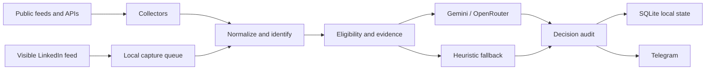

# WorkHunter

WorkHunter is a local-first radar for software engineering opportunities. It collects public listings from multiple
sources, normalizes and deduplicates them, applies deterministic eligibility
rules, evaluates ambiguous cases with a configurable LLM provider and sends
useful decisions to Telegram.

It is a personal project designed to run continuously on a Linux host. GitHub
is used for source control and automated tests; production collection and
runtime state remain on the local machine.

WorkHunter evolved from an earlier local prototype called Job Finder. That
history remains in the engineering records; the product, repository and public
documentation now use the WorkHunter name.

## Why this project exists

Job search data is fragmented, duplicated and often incomplete. WorkHunter
turns that problem into an auditable pipeline with explicit decisions:


```mermaid
flowchart LR
    A[Public feeds and APIs] --> B[Collectors]
    C[Visible LinkedIn feed] --> D[Local capture queue]
    B --> E[Normalize and identify]
    D --> E
    E --> F[Eligibility and evidence]
    F --> G[Gemini / OpenRouter]
    F --> H[Heuristic fallback]
    G --> I[Decision audit]
    H --> I
    I --> J[SQLite local state]
    I --> K[Telegram]
```

The detailed design is in [Architecture](docs/architecture.md). Engineering
decisions and evolution history are documented in [docs/](docs/).

The runtime follows one path for scheduled and manually submitted listings:

```text
collect → normalize → identify → deduplicate → evaluate → notify → audit
```

Scheduled collectors discover listings on their cadence. A Telegram URL or a
LinkedIn browser capture enters the same normalization and evaluation pipeline,
but is processed independently so an immediate analysis does not delay the
next scheduled cycle.

## Current status

The current implementation includes local scheduled collection, Telegram
notifications, Gemini/OpenRouter selection, heuristic fallback, SQLite
persistence, manual URL analysis, LinkedIn browser capture and health checks.
Run the test suite locally with `python -m pytest -q` to verify the current
checkout; CI runs the same suite without production credentials.

## Capabilities

- Multi-source collection through public APIs, RSS/Atom feeds and public ATS
  listings.
- LinkedIn browser capture for content already visible in an authenticated
  desktop browser session.
- Stable source identity using native IDs and normalized URLs.
- Cross-source deduplication and evidence-aware filtering.
- Configurable Gemini or OpenRouter provider with a shared judge interface.
- Deterministic heuristic fallback when an LLM is unavailable.
- Manual URL intake and an independent worker for immediate analysis.
- SQLite audit trail for decisions, collection attempts and recovery.
- Telegram notifications, local health checks and an external heartbeat.
- Automated tests and CI that validate code without executing real collection.

## Sources

| Source | Access pattern | Role |
| --- | --- | --- |
| Gupy | Public API and detail enrichment | Targeted company listings |
| GitHub Issues | GitHub REST API | Community job boards |
| RSS/Atom | Public feeds | Career pages and search feeds |
| Trampos.co | Public listing API | Technical opportunities |
| GeekHunter | Public listing/detail pages | Complementary source |
| LinkedIn | Guest queries plus visible browser capture | Coverage complement |

LinkedIn coverage is intentionally bounded. The browser extension only submits
posts that LinkedIn has loaded in the open feed. It does not bypass login,
challenges, rate limits or access controls.

## Reliability and safety

Each source has isolated timeout, retry and rate-limit handling. A source
failure is recorded and does not have to stop the complete cycle. A separate
manual worker prevents a user-submitted URL from waiting for the scheduled
radar. systemd restarts local services, while the heartbeat gives an external
signal when the host stops checking in.

Secrets, browser profiles, databases and runtime logs stay outside Git. See
[SECURITY.md](SECURITY.md) for the security boundary and
[CONTRIBUTING.md](CONTRIBUTING.md) for repository hygiene.

## Quick start

Requirements: Python 3.10 or newer, Git and a Linux host for the production
services. The commands below use `python3` before the virtual environment is
activated, which also works on distributions where `python` is not installed.

```bash
git clone https://github.com/RafalauriSantos/workhunter.git
cd workhunter
python3 -m venv .venv
source .venv/bin/activate
python -m pip install -r requirements.txt
cp .env.example .env
```

Edit `.env` with local values. Keep the real file untracked. The public
configuration template is [config.example.json](config.example.json); the
personal `config.json` contains the owner's monitor selection.

The judge tries the primary provider, then the fallback provider, and finally
keeps the heuristic decision if both providers fail. Calls are limited per
cycle and provider failures enter a short cooldown.

For Gemini as primary with OpenRouter free fallback:

```env
LLM_PRIMARY_PROVIDER=gemini
LLM_PRIMARY_MODEL=gemini-3.5-flash-lite
LLM_FALLBACK_PROVIDER=openrouter
LLM_FALLBACK_MODEL=openrouter/free
LLM_MAX_CALLS_PER_CYCLE=20
GEMINI_API_KEY=your_key_here
OPENROUTER_API_KEY=your_key_here
```

Run one cycle or start the local runner:

```bash
python monitor.py --once
python monitor.py
```

The systemd units under `deployment/` are installation examples for the local
host. They contain `REPLACE_WITH_INSTALL_DIR` placeholders and must be reviewed
before installation. The usual sequence is:

```bash
sed -i 's|REPLACE_WITH_INSTALL_DIR|/absolute/path/to/workhunter|g' deployment/*.service.example
sudo install -m 0644 deployment/workhunter-inbox.service.example /etc/systemd/system/workhunter-inbox.service
sudo install -m 0644 deployment/workhunter-linkedin-ingest.service.example /etc/systemd/system/workhunter-linkedin-ingest.service
sudo install -m 0644 deployment/workhunter-heartbeat.service.example /etc/systemd/system/workhunter-heartbeat.service
sudo install -m 0644 deployment/workhunter-heartbeat.timer.example /etc/systemd/system/workhunter-heartbeat.timer
sudo systemctl daemon-reload
sudo systemctl enable --now workhunter-inbox.service workhunter-linkedin-ingest.service
sudo systemctl enable --now workhunter-heartbeat.timer
```

The scheduled collector service is installed separately on the local host. Its
existing systemd unit may retain the historical `job-finder.service` name for
backward compatibility; inspect the unit configured on the machine with
`systemctl status job-finder.service`.
Use `journalctl -u workhunter-inbox.service -f` to follow the manual worker.

The exact service mode may be changed to a user unit when the host policy
requires it; the important requirement is that the services run without a
logged-in desktop session and use the persistent local WorkHunter data
directory.

## Collection cadence

The monitor checks for new opportunities every **30 minutes**. LinkedIn queries
use an approximately **6-hour** window (`r21600`), while deduplication prevents
an already recorded job from generating another alert. The search window
improves coverage; it does not change the cycle frequency.

## External heartbeat

The heartbeat is optional and is intended to notify you when the local host
stops checking in. Configure the external watchdog or Cloudflare endpoint in
`.env`:

```env
WORKHUNTER_HEARTBEAT_URL=https://your-watchdog-endpoint.example/heartbeat
WORKHUNTER_HEARTBEAT_TOKEN=your_private_token
```

The timer sends a check every 15 minutes. Configure the watchdog with a
grace period longer than that interval to tolerate scheduling and network
delay. Test the local unit with:

```bash
sudo systemctl start workhunter-heartbeat.service
sudo journalctl -u workhunter-heartbeat.service -n 50 --no-pager
```

## Manual and LinkedIn intake

Register a URL with the lightweight CLI:

```bash
./workhunter add 'https://www.linkedin.com/jobs/view/123456789/'
./workhunter worker-once
./workhunter diagnose
```

The browser extension under `tools/linkedin_extension/` captures relevant
posts visible in the LinkedIn feed and sends them to the loopback receiver.
The receiver deduplicates content and places it in the same analysis pipeline.
The Telegram worker uses long polling: it waits for updates for up to 45
seconds instead of repeatedly asking whether a message arrived. Commands are
answered immediately and do not start a collection cycle. A submitted job URL
starts only the manual analysis path; the scheduled collectors remain
independent.
To install it:

1. Start `workhunter-linkedin-ingest.service`.
2. Open `chrome://extensions` in Chrome or Chromium.
3. Enable **Developer mode**.
4. Select **Load unpacked** and choose `tools/linkedin_extension/`.
5. Open LinkedIn in a logged-in desktop tab and leave the feed visible.
6. Scroll the feed occasionally so new posts are loaded.

The extension shows `WorkHunter ativo` when loaded and
`WorkHunter: vaga capturada` after a post is accepted. It does not read
passwords or cookies and does not bypass LinkedIn access controls.

## Testing

The suite covers collectors, normalization, identity, deduplication, scoring,
LLM contracts, fallback behavior, manual intake, LinkedIn ingestion and health
checks.

```bash
python -m pytest -q
```

GitHub Actions runs this test suite only. It does not execute collection, use
production credentials or commit runtime state.

## Documentation

- [Architecture](docs/architecture.md)
- [Operations](docs/OPERATIONS.md)
- [Engineering methodology](docs/engineering/methodology.md)
- [Security policy](SECURITY.md)
- [Contribution guide](CONTRIBUTING.md)
- [License](LICENSE)

## Roadmap

- Improve coverage measurement with collection-attempt evidence.
- Compare manual LinkedIn findings against future collector results.
- Calibrate scoring using a time-separated evaluation set.
- Expand reliable public ATS and RSS adapters.

The project does not claim complete market coverage. Its goal is a measurable,
recoverable and maintainable personal radar.
