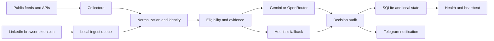

# Architecture

Job Finder is a local-first pipeline for discovering and evaluating software
engineering opportunities. It is intentionally designed as a single-user
service with durable local state and explicit operational boundaries.

## Boundaries

- Collectors retrieve public listings and record collection evidence.
- The LinkedIn extension submits only content visible in the user's browser to
  a loopback-only receiver.
- Normalization and source identity make URLs and native IDs comparable.
- Deterministic eligibility and evidence checks run before an LLM call.
- Gemini is the default provider; OpenRouter is an alternative. If no provider
  is available, the heuristic path keeps the cycle alive.
- SQLite stores durable local decisions, manual cases and recovery information.
- Telegram is a delivery channel, not the source of truth.
- systemd keeps the local services running and restarts recoverable failures.

## Reliability model

Timeouts, HTTP failures and rate limits are recorded and handled per source.
The manual inbox has its own worker so a user-submitted job does not have to
wait for the scheduled radar cycle. A local health snapshot and an external
heartbeat provide independent signals when the host stops responding.

## Deliberate limitations

The project does not promise complete coverage of LinkedIn. Public endpoints
and visible browser content have different coverage, and a browser capture
requires the LinkedIn feed to be open and loaded. The system also does not
attempt to bypass challenges or authenticated access controls.
