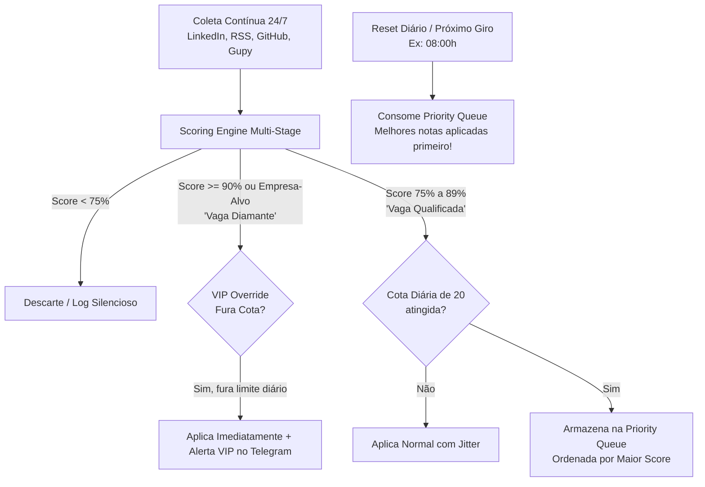

# Hermes Auto-Apply & Tracking Engine: Estratégia de Arquitetura

- **Status**: Proposta Registrada (Em Análise)
- **Data de Registro**: 2026-09-16
- **Responsável**: Pair Programming (Rafael & Antigravity)

---

## 1. Visão Geral e Objetivo

O objetivo do agente **Hermes Auto-Apply & Tracking** é evoluir o atual buscador de vagas (`job-finder`) para um agente autônomo de candidatura, acompanhamento e triagem de respostas.

### O Princípio Fundamental
Permitir que o desenvolvedor concentre 100% de seu tempo e energia no estudo dos fundamentos de engenharia, prática com código e preenchimento de lacunas de competência técnica, enquanto o Hermes:
1. **Captura vagas antecipadamente** (24/7).
2. **Aplica com precisão cirúrgica** em vagas de alta compatibilidade.
3. **Organiza e mantém um Kanban atualizado** com cada candidatura.
4. **Monitora feedbacks das empresas** (convites de entrevistas, testes técnicos e recusas) diretamente pela caixa postal, emitindo alertas prioritários no Telegram.

---

## 2. Política de Quota & Segurança Antiban

### 2.1 Por que o limite de ~20 vagas/dia?
- **Ban Prevention**: Plataformas como LinkedIn, Indeed e sistemas ATS modernos contam com heurísticas de detecção de automação e rate-limits severos. Disparar volumes anômalos (50-100/dia) resulta em suspensão de conta ou bloqueio de CPF/e-mail em bases de recrutamento.
- **Estratégia Sniper**: O objetivo não é volume cego, mas sim garantir que apenas vagas com índice de relevância real ($\text{Score} \ge 75\%$) consumam as aplicações.
- **Jitter e Pacing Humano**: Entre cada candidatura automatizada, o sistema aplica um atraso estocástico (*jitter*) de 45 a 180 segundos com pausas e movimentações não padronizadas, simulando navegação humana.

---

## 3. Modelo de Captação Contínua & Fila de Prioridade (Priority Queue)

A captação e o processamento de vagas **nunca são interrompidos** quando a cota diária de 20 é atingida. Em vez disso, o sistema adota um modelo de **Fila de Prioridade em 3 Níveis**:

### 3.1 Nível 1: Vaga Diamante / VIP Override (Fura Cota)
- **Gatilho**: $\text{Score} \ge 90\%$ OU empresa prioritária do `profile.json` (`Goomer`, `GFT`, etc.) com stack compatível.
- **Ação**: Fura o teto diário de 20 vagas e aplica imediatamente.
- **Trava de Segurança (Hard Ceiling)**: Máximo de 5 *overrides* adicionais por dia, evitando qualquer risco de loop anômalo.

### 3.2 Nível 2: Fila de Espera Prioritária (`Priority Queue`)
- **Gatilho**: Vagas qualificadas ($\text{Score}$ entre $75\%$ e $89\%$) captadas após o esgotamento da cota de 20.
- **Armazenamento**: Persistido em `storage/priority_queue.json`.
- **Critério de Ordenação**: `Score DESC, created_at DESC` (as vagas com maior nota passam na frente, independente de terem sido descobertas mais tarde).

### 3.3 Nível 3: Drenagem no Próximo Giro
- No início do próximo ciclo diário (ex: 08:00h):
  1. O Hermes consome primeiramente os itens acumulados na **Priority Queue** em ordem decrescente de relevância.
  2. As vagas restantes da cota do novo dia ficam disponíveis para novas oportunidades em tempo real.

---

## 4. Canais de Execução de Candidatura

| Canal | Tipo de Vaga | Estratégia de Aplicação | Tratamento de Exceções |
| :--- | :--- | :--- | :--- |
| **Email Applicator** | Vagas com e-mail de contato (GitHub, RSS, Indeed) | Geração de carta de apresentação focada + anexo do currículo PDF via SMTP | Validação estrita de e-mail e SPF/DKIM para não cair em spam |
| **LinkedIn Easy Apply** | Candidatura Simplificada | Automação via Playwright com perfil de navegador persistente | Perguntas desconhecidas/dissertativas pausam e notificam Telegram com formulário rápido |
| **Gupy Assistant** | Vagas Gupy | Semi-automático: Pré-carrega dados, sintetiza palavras-chave e entrega link direto 1-click no Telegram | Evita bloqueios de CPF e realiza preenchimento seguro |

---

## 5. Integração com Kanban

O sistema manterá uma interface abstrata (`BaseKanban`) desacoplada do provedor de serviço:

### Colunas Padrão:
1. `[Candidatado]` (Inserção automática logo após envio)
2. `[Em Análise]` (Confirmação de recebimento da empresa)
3. `[Entrevista / Teste]` (Ação humana requerida)
4. `[Aprovado / Proposta]`
5. `[Rejeitado / Arquivado]` (Atualizado silenciosamente)

### Provedores Candidatos:
- **GitHub Projects v2** (GraphQL API - integrado ao repositório, custo zero, sem ferramentas terceiras).
- **Notion** (Notion Database API - visual e acessível no app mobile).
- **Trello** (REST API simples e ágil).

---

## 6. Monitoramento de Respostas (Feedback Loop)

Worker assíncrono que inspeciona a caixa postal (IMAP / Gmail API):
- Identifica remetentes de RH e plataformas ATS (`Gupy`, `Greenhouse`, `Lever`, `Kenoby`, etc.).
- **Detecção de Entrevista/Teste**: Se o corpo do e-mail contiver termos como *entrevista*, *teste técnico*, *desafio*, *agendamento*:
  - Dispara alerta sonoro/urgente no Telegram com link do convite.
  - Move o card correspondente no Kanban para `[Entrevista / Teste]`.
- **Detecção de Recusa**: Se contiver termos como *agradecemos seu interesse*, *outro profissional*, *manteremos seu perfil*:
  - Move o card silenciosamente para `[Rejeitado / Arquivado]`, sem poluir o Telegram.

---

## 7. Módulo de Vagas em Nichos Dev (Baixa Concorrência)

Em plataformas de massa (Indeed, Gupy), uma vaga júnior recebe entre 500 e 800 candidaturas rapidamente. Em contrapartida, vagas anunciadas em comunidades fechadas de desenvolvedores costumam receber apenas **15 a 30 candidaturas**, multiplicando as chances de visibilidade do candidato.

### Fontes Monitoradas:
- Repositórios especializados de vagas do GitHub Brasil (`frontendbr/vagas`, `backend-br/vagas`, `react-brasil/vagas`).
- Murais e feeds técnicos com vagas postadas diretamente por líderes técnicos e CTOs.

### Dinâmica no Hermes:
- O coletor do GitHub faz a leitura via GitHub Issues API.
- Vagas com descrição limpa e e-mail direto de contato entram prioritariamente no fluxo de aplicação ou alerta imediato.

---

## 8. Radar de Voluntariado & Open Source Comunitário (Experiência Sem Pressão)

Para resolver o clássico dilema *"pedem experiência, mas não dão oportunidade"*, o Hermes contará com um módulo de busca de colaborações voluntárias e contribuições práticas.

### Como Funciona:
1. **Monitoramento de Demandas Reais**:
   - Escaneia repositórios abertos e iniciativas comunitárias com tags amigáveis para iniciantes: `good first issue`, `help wanted`, `iniciante` nas tecnologias do candidato (`React`, `TypeScript`, `Node.js`, `Tailwind`).
2. **Notificação Amiga no Telegram**:
   - Quando surge uma tarefa bem descrita (ex: criar uma tela de cadastro, ajustar estilização ou corrigir um bug simples de formulário):
   - O Hermes avisa no Telegram com uma explicação simples do desafio e o link direto.
3. **Benefícios para a Carreira**:
   - **Histórico Verde no GitHub**: Comprova atividade e prática real no perfil.
   - **Trabalho em Equipe**: Vivência com *Pull Requests*, *Code Review* e convenções de código de times reais.
   - **Item de Peso no Currículo**: *"Desenvolvedor Voluntário / Colaborador no Projeto Comunitário X"*.

---

## 9. Fases de Implementação Atualizadas

1. **Fase 1 (Fundação & Vagas Estratégicas)**:
   - Quota Manager (limite nominal ~20/dia + human jitter).
   - Fila de Prioridade ordenada por nota (`priority_queue.json`).
   - Coletor aprofundado de Vagas de Nicho (GitHub Issues Brasil).
   - Envio de CV com carta sob medida por E-mail + Registro no Kanban.
2. **Fase 2 (Prática Real & Feedback Loop)**:
   - Radar de Voluntariado & Tarefas Open Source no Telegram.
   - Leitor de Respostas e Convites por E-mail (IMAP) com atualização de status no Kanban.
3. **Fase 3 (Automações Avançadas)**:
   - LinkedIn Easy Apply assistido via Playwright.
   - Assistente 1-click para vagas Gupy.

